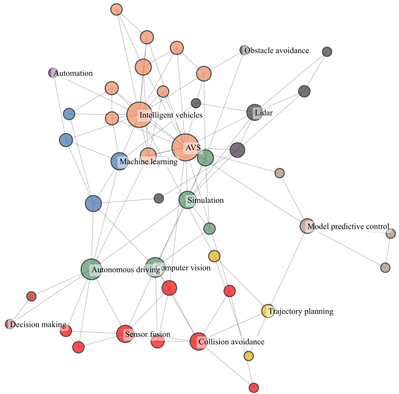
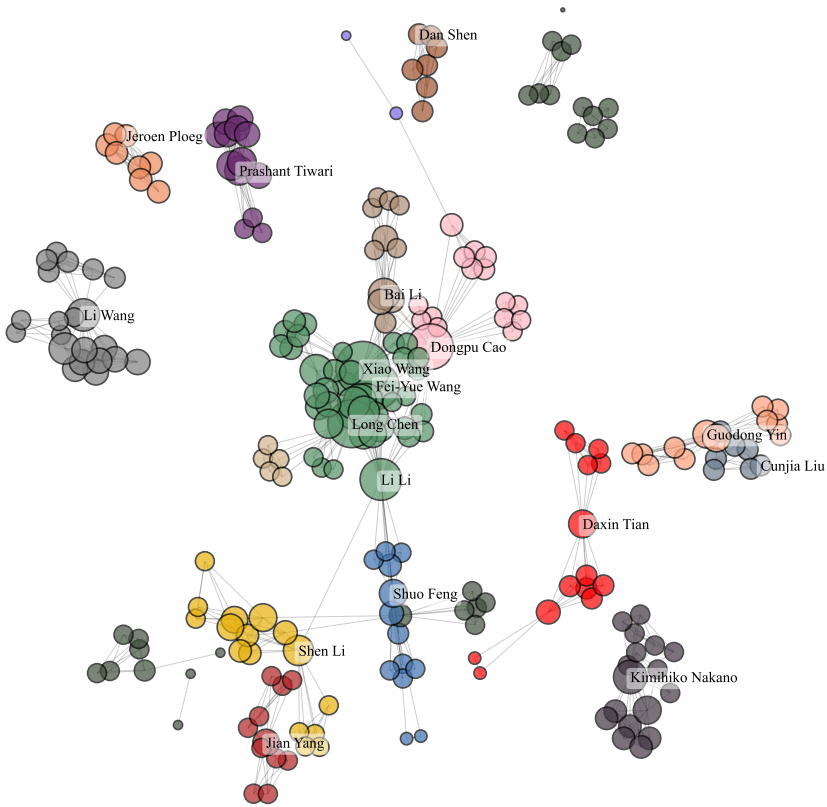

# GirvanNewmanClustering

## Introduction
This project implements a community detection algorithm that analyzes articles in IEEE T-IV journal from January 2019-January 2023 to discover patterns of collaboration among them.

The project uses two python libraries called `networkx` and `community` to implement the division of communities. It also uses the matplotlib library to map communities.

## Details
Three networks were constructed in this project, including a co-authorship network, a co-keyword network, and an author-keyword network.

Example of community division map:

